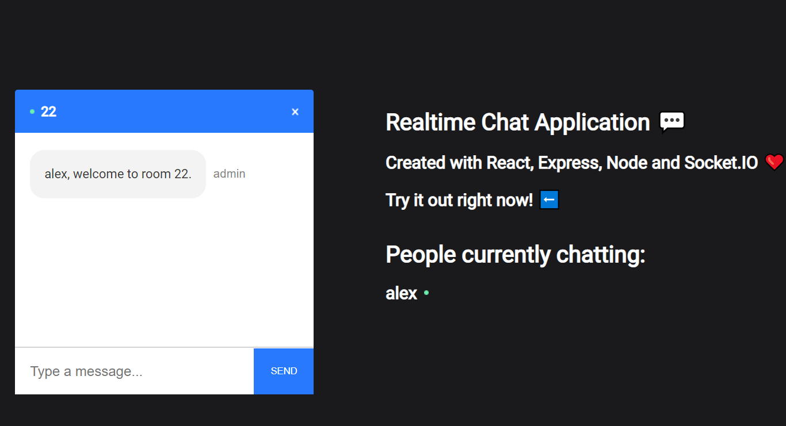

# Chat Application info

## Live Link

- To view this page: https://nifty-bell-a22a2c.netlify.app
- My Portfolio: https://mguaraz120.github.io/Portfolio/
- My Linkedin Page: https://www.linkedin.com/in/mario-vizcaino-187ab9104/

## Description on how to use the app

- This full Realtime Chat Application was created with React on the front end and with NodeJS + Socket.io web socket library on the back end.

-The user has to login with a username and a room number. Once logged in, the user joins the room waiting for at least a second user to join the same room. Once the users are joined in the same room, they can start chattting in realtime.

## Technologies Used

- React
- HTML
- CSS
- Javascript
- Socket-io
  

## Deployed

-Heroku
-Netlify
